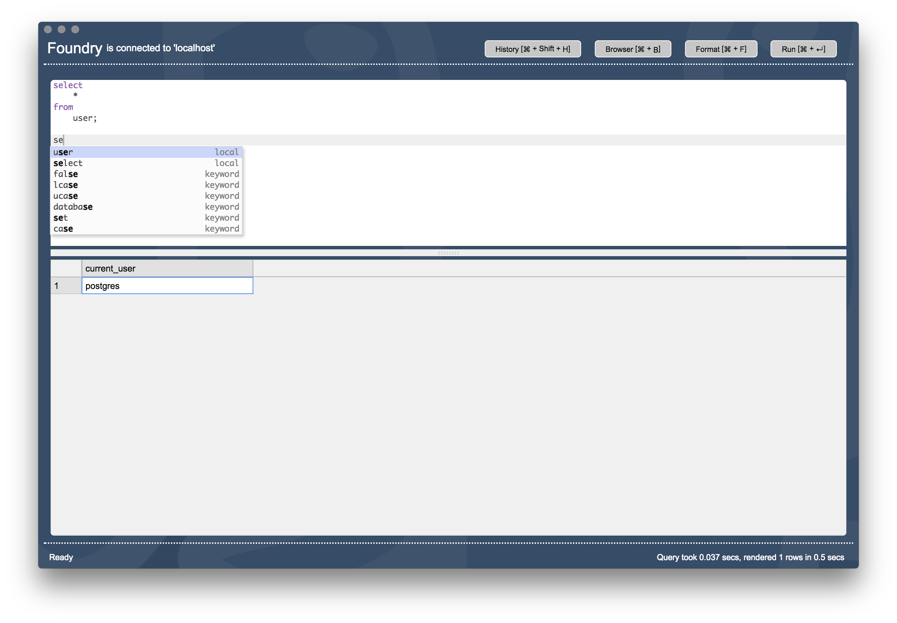

Foundry - an extensible postgres sql client
========================

### License

[Free 30 day trial](https://www.thought.so/trial) or [purchase a 1 year license for $20](https://www.thought.so/purchase)

### Download

[Download the latest Mac client here](https://github.com/bluesockets/foundry/releases/download/1.0.0/Foundry-1.0.0.dmg)

### FAQs (more coming)

[How to apply your license](https://www.thought.so/tutorials/activation)

### Feedback

Please send all comments, feedback, suggestions to feedback@thought.so

### About

If you are looking for a lightweight querying tool with extensible features analytics tooling, you'e come to the right place!
Foundry is a modern database client. See below for an overview of features and plugins.

#### Currently under development
 * visual query builder (planned release for Q1 2019)

#### Current Features

 * connection information store with encryption
 * connect to postgres databases without crashing
 * run queries and view results
 * auto formatting queries
 * integrated query history
 * schema browser
 * plugin architecture (live in Q2 2018)
 * support comments in queries (live in Q3 2018)
 
#### Plugins
 * dashboard performance charts (live in Q3 2018)
 
We plan on maturing Foundry into a world class data performance and database analysis toolkit. 
Clearly we are not there yet, but we will continue to add value by releasing plugins that allow users to analyze database performance easily and deeply. 
Feel free to check us out now with a free trial, and if you are not quite ready for us now then check back with us in a few months to see the progress we've made. 
 
### Bugs

Not all software is perfect, including ours. We will do the best we can to personally respond to each request in a timely manner. When submitting a ticket through [github issues](https://github.com/bluesockets/foundry/issues) please make sure to include screenshots if possible, as well as steps to reproduce the error.  

 
### Road map 

The features below are panned for release over the next 6-9 months. We plan on extending Foundry with several plugin features available through our humble marketplace. Check the plugins page for the new plugins once they are released.

**Planned Features**
 * searchable query history (Q4 2018)
 * export to csv/json  (Q4 2018)
 * connection host groupings  (Q1 2019)
 * contextual menus (Q1 2019)
 * central encrypted connection backup/restore/sync (Q1 2019)

**Plugins**
 * themes (Q4 2018)
 * log analyzer  (Q3 2018)
 * pg connection administrator  (Q1 2019)
 * visual schema builder (Q2 2019)
 * ERD diagram generator (Q3 2019)
 